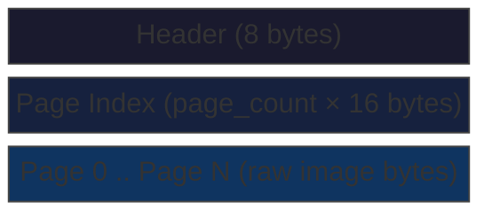
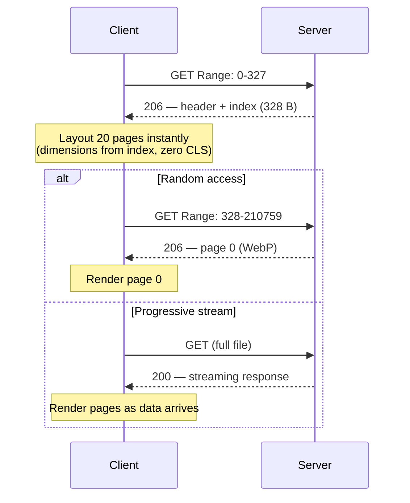

# MCZ Format Specification

8-byte header + 16 bytes per page index + raw image data. All **little-endian**.

## Layout

## Header (8 bytes)

| Offset | Size | Field | Description |
|--------|------|-------|-------------|
| 0 | 4 | `magic` | `MCZ\x01` (`4d 43 5a 01`) |
| 4 | 1 | `version` | Format version (`1`) |
| 5 | 1 | `flags` | Reserved, must be `0` |
| 6 | 2 | `page_count` | Number of pages, u16 LE |

## Page Index Entry (16 bytes × page_count)

| Offset | Size | Field | Description |
|--------|------|-------|-------------|
| 0 | 4 | `offset` | Byte position of image data, u32 LE |
| 4 | 4 | `size` | Encoded image byte size, u32 LE |
| 8 | 2 | `width` | Image width in pixels, u16 LE |
| 10 | 2 | `height` | Image height in pixels, u16 LE |
| 12 | 1 | `format` | `0` = WebP, `1` = JPEG, `2` = JXL |
| 13 | 3 | `reserved` | Must be `0` |

## Limits

- Max pages: 65,535 (u16)
- Max page size: ~4 GB (u32)
- Max file offset: ~4 GB (u32)
- Supported formats: WebP, JPEG, JPEG XL

## Streaming

